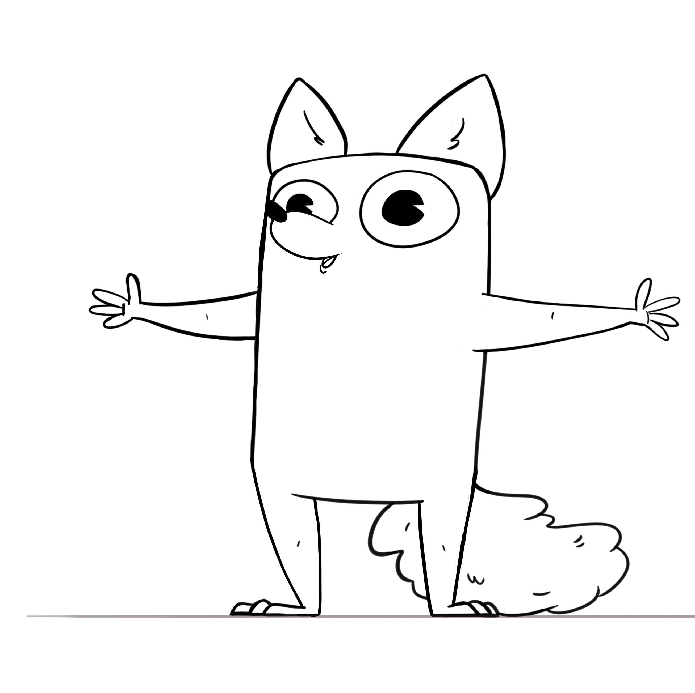
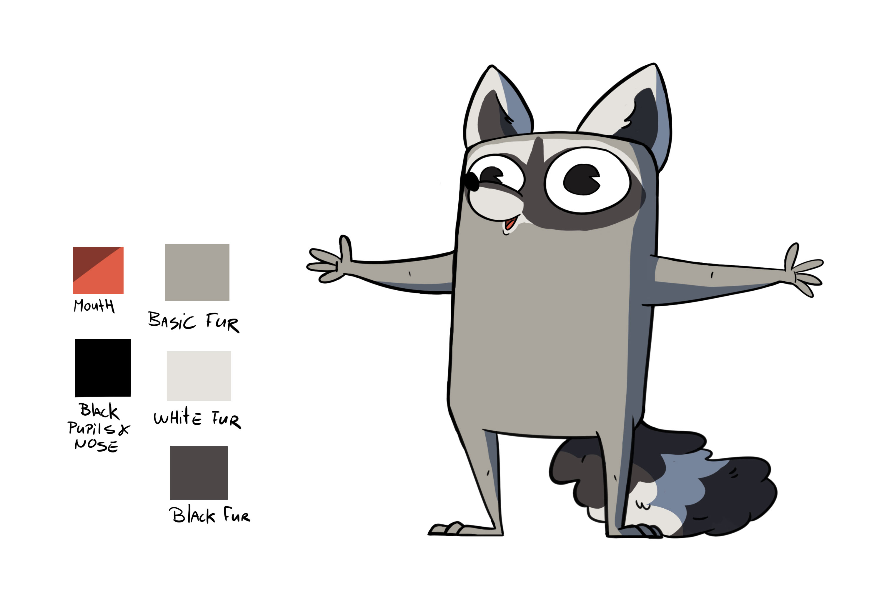

# Van Happen Containers 

We are making this project for the Van Happen Containers company in Eindhoven.
They want a game that draws the attention of young people between the ages of 8 and 14 to the importance of recycling.

>We received a basic concept from fellow students.

## our basic concepts

### concept idea's for the main player
The main p

    
    

## Our game becomes a mobile game for Android